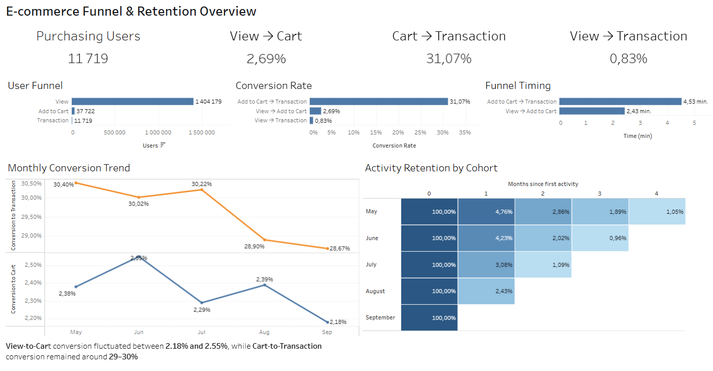
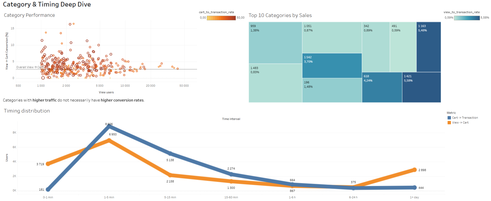

# Анализ воронки и удержания пользователей в e-commerce

Комплексный анализ поведения пользователей интернет-магазина на основе событий просмотра товаров, добавления в корзину и покупки.

В проекте исследуются воронка продаж, конверсия между этапами, время перехода к покупке, когортное удержание и эффективность товарных категорий. Результаты представлены в интерактивных дашбордах Tableau.

## Бизнес-задача

Определить, на каких этапах пользовательского пути происходят основные потери, насколько эффективно пользователи переходят между этапами воронки и как меняется поведение пользователей во времени.

Результаты анализа могут использоваться для поиска точек роста конверсии и определения направлений для дальнейшего продуктового анализа.

## Данные

**Источник:** [RetailRocket Recommender System Dataset](https://www.kaggle.com/datasets/retailrocket/ecommerce-dataset), Kaggle.

Датасет содержит события пользователей интернет-магазина:

- `view` — просмотр товара
- `addtocart` — добавление товара в корзину
- `transaction` — покупка

Дополнительно используются данные о свойствах товаров и структуре категорий.

Основные таблицы ClickHouse:

- `events_raw` — события пользователей
- `item_properties_raw` — свойства товаров
- `category_tree_raw` — структура категорий

## Методология

**1. Подготовка данных**

Данные загружены в ClickHouse и подготовлены для аналитических запросов. Для анализа категорий из `item_properties_raw` выделена информация о `categoryid`.

**2. Анализ воронки**

Рассчитано количество уникальных пользователей на каждом этапе:

`View → Add to Cart → Transaction`

Для последовательного анализа учитывается хронологический порядок событий пользователя для конкретного товара.

**3. Конверсия**

Рассчитаны показатели:

- View → Cart
- Cart → Transaction
- View → Transaction

**4. Анализ времени**

Исследуется время перехода пользователей между этапами:

- View → Cart
- Cart → Transaction

Используются медианные значения и распределение пользователей по временным интервалам.

**5. Когортный анализ**

Пользователи объединяются в когорты по месяцу первой активности. Для каждой когорты рассчитывается активность пользователей в последующие месяцы.

**6. Анализ категорий**

Категории сравниваются по:

- объёму просмотров
- количеству пользователей
- добавлениям в корзину
- покупкам
- конверсии между этапами воронки

Для снижения влияния категорий с очень маленьким объёмом данных используются категории с достаточным количеством просмотров.

## Основные результаты

| Метрика | Значение |
|---|---|
| View → Transaction | 0,83% |
| View → Cart | 2,69% |
| Cart → Transaction | 31,07% |
| Медиана Cart → Transaction | 4,53 мин |

### Основные наблюдения

Основная потеря пользователей происходит между просмотром товара и добавлением в корзину. При этом среди пользователей, которые уже добавили товар в корзину, доля дошедших до покупки значительно выше.

Это позволяет рассматривать этап View → Cart как отдельную область для дальнейшего исследования: качество карточки товара, ассортимент, цена, рекомендации и другие факторы, которые могут влиять на переход к следующему этапу.

Анализ категорий также показывает, что высокий объём трафика сам по себе не гарантирует высокую конверсию. Поэтому при оценке категорий важно учитывать одновременно и объём трафика, и эффективность переходов между этапами.

## Ограничения анализа

- В датасете отсутствует информация о каналах привлечения пользователей.
- Нет данных о характеристиках устройств пользователей.
- Отсутствует информация о ценах товаров в исходных событиях.

## Дашборды

Интерактивная версия дашбордов пока не опубликована — ниже скриншоты. Рабочий файл `.twbx` со всеми расчётами и визуализациями лежит в папке `tableau/`, его можно открыть в Tableau Public Desktop (бесплатно) или Tableau Desktop.

**Dashboard 1 — Funnel & Retention Overview**

Общий обзор:

- ключевые показатели воронки
- конверсия между этапами
- динамика конверсии по месяцам
- когортный анализ удержания



**Dashboard 2 — Category & Timing Deep Dive**

Детальный анализ:

- распределения времени между этапами
- категорий товаров
- объёма трафика
- конверсии категорий
- взаимосвязи между популярностью категории и её эффективностью



## Структура проекта

```
ecommerce-funnel-analysis/
│
├── sql/
│   ├── 00_data_preparation.sql
│   ├── 01_funnel.sql
│   ├── 02_conversion.sql
│   ├── 03_sequential_funnel.sql
│   ├── 04_funnel_timing.sql
│   ├── 05_cohort_analysis.sql
│   ├── 06_monthly_conversion.sql
│   ├── 07_category_analysis.sql
│   ├── 08_top_categories.sql
│   └── 09_timing_distribution.sql
│
├── tableau/
├── images/
└── README.md
```

## Стек

- SQL
- ClickHouse
- Tableau Public

## Что можно исследовать дальше

- анализ конверсии по устройствам и источникам трафика
- более детальный анализ поведения пользователей внутри категорий
- исследование причин изменения конверсии во времени
- анализ повторных покупок и долгосрочного retention

**Автор:** Нурзиля Маскова  
**GitHub:** [nurzilamaskova-cmd](https://github.com/nurzilamaskova-cmd)  
